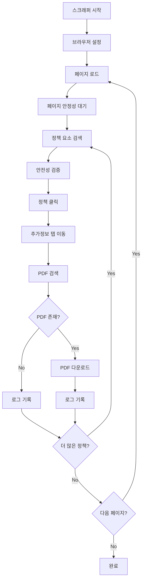

# Bokjiro PDF Scraper

복지로(bokjiro.go.kr) 웹사이트에서 정책 관련 PDF 파일을 자동으로 수집하는 안전한 웹 스크래퍼입니다.

## 📋 프로젝트 개요

이 프로젝트는 복지로 웹사이트의 임신·출산, 영유아, 아동 관련 정책 정보를 자동으로 수집하고, 해당 정책의 PDF 파일을 다운로드하는 도구입니다. 총 12페이지에 걸쳐 101개의 정책을 처리할 수 있도록 설계되었습니다.

## 🛠️ 사용 라이브러리

### 필수 라이브러리

```python
# 웹 자동화
selenium==4.x.x              # 브라우저 자동화
webdriver-manager==3.x.x     # ChromeDriver 자동 관리

# 내장 라이브러리
os                            # 파일 시스템 조작
time                          # 시간 지연 및 타이밍 제어
json                          # 로그 데이터 저장/로드
traceback                     # 에러 추적
sys                           # 시스템 관련 기능
datetime                      # 타임스탬프 생성
glob                          # 파일 패턴 매칭 (fresh_start.py)
shutil                        # 파일 조작 (fresh_start.py)
```

### 설치 방법

```bash
pip install selenium webdriver-manager
```

## 🏗️ 아키텍처 구조

### 1. 전체 시스템 아키텍처

```
bokjiro_scraper/
├── bokjiro_scraper.py          # 메인 스크래퍼
├── fresh_start.py              # 초기화 도구
├── cleanup_duplicates.py       # 중복 파일 정리
├── data/
│   ├── logs/
│   │   ├── download_log.json   # 다운로드 로그
│   │   ├── debug_log.txt       # 디버그 로그
│   │   ├── checkpoint.json     # 체크포인트 데이터
│   │   └── cleanup_log.json    # 정리 로그
│   └── pdfs/
│       └── bokjiro/            # 다운로드된 PDF 파일들
```

### 2. 핵심 컴포넌트

#### A. 브라우저 관리 시스템
```python
def setup_driver()              # Chrome 브라우저 설정
def restart_browser_if_needed() # 리소스 관리를 위한 브라우저 재시작
def monitor_browser_state()     # 브라우저 상태 모니터링
```

#### B. 페이지 안정성 시스템
```python
def wait_for_page_stable()      # 동적 페이지 로딩 완료 대기
def wait_for_element_stable()   # 요소 안정성 확인
```

#### C. 안전성 검증 시스템
```python
def is_safe_policy_element()    # 정책 링크 안전성 검증
def is_safe_tab_element()       # 탭 요소 안전성 검증
```

#### D. 정책 제목 추출 시스템
```python
def extract_policy_title()      # 다중 방법론 제목 추출
def extract_nested_text()       # 중첩 요소 텍스트 추출
def extract_from_onclick_or_href() # 속성 기반 제목 추출
def clean_policy_title()        # 제목 정규화
```

#### E. PDF 처리 시스템
```python
def find_pdf_elements()         # PDF 요소 탐지
def process_detail_page()       # PDF 다운로드 처리
def wait_for_download_completion() # 다운로드 완료 확인
```

#### F. 페이지네이션 시스템
```python
def check_pagination_available() # 다음 페이지 존재 확인
def detect_last_page()          # 마지막 페이지 감지
```

#### G. 로깅 및 복구 시스템
```python
def debug_log()                 # 다층 로깅 시스템
def save_checkpoint()           # 중단점 저장
def load_checkpoint()           # 중단점 복구
def save_processed_log()        # 처리 이력 저장
```

### 3. 데이터 플로우



## 🤔 기술적 선택 이유

### 1. Selenium 사용 이유

#### 복지로 웹사이트의 특성:
- **동적 콘텐츠**: JavaScript로 동적 생성되는 정책 리스트
- **AJAX 로딩**: 비동기 데이터 로딩으로 인한 타이밍 이슈
- **복잡한 페이지네이션**: 범위 기반 페이지 전환 시스템
- **인증 요소**: 공동인증서 등 위험한 UI 요소 존재

#### 대안 라이브러리와의 비교:

| 라이브러리 | 장점 | 단점 | 복지로 적합성 |
|------------|------|------|---------------|
| **Selenium** | ✅ 완전한 브라우저 환경<br>✅ JavaScript 실행<br>✅ 동적 콘텐츠 처리<br>✅ 사용자 행동 시뮬레이션 | ❌ 느린 속도<br>❌ 리소스 사용량 높음 | 🟢 **최적** |
| requests + BeautifulSoup | ✅ 빠른 속도<br>✅ 가벼움 | ❌ JavaScript 미지원<br>❌ 동적 콘텐츠 처리 불가 | 🔴 **부적합** |
| Scrapy | ✅ 고성능<br>✅ 확장성 | ❌ JavaScript 제한적<br>❌ 복잡한 설정 | 🟡 **제한적** |
| Playwright | ✅ 현대적<br>✅ 빠름 | ❌ 복잡한 설치<br>❌ 생태계 제한 | 🟡 **가능하지만 과도** |

### 2. WebDriverWait 전략

```python
# 명시적 대기 (Explicit Wait) 사용
WebDriverWait(driver, 20).until(
    EC.element_to_be_clickable((By.CSS_SELECTOR, selector))
)
```

**이유:**
- 복지로의 불규칙한 로딩 시간
- 네트워크 지연에 대한 견고성
- 불필요한 대기 시간 최소화

### 3. 다층 안전성 검증

#### 문제상황:
복지로 웹사이트는 정책 링크와 인증서 관련 링크가 유사한 DOM 구조를 가짐

#### 해결방안:
```python
def is_safe_policy_element(element):
    # 블랙리스트 방식 + 화이트리스트 방식 결합
    dangerous_patterns = ['certificate', '인증서', '공동인증서', ...]
    safe_patterns = ['자세히 보기', 'detail', 'TWAT52005M', ...]
```

### 4. 체크포인트 시스템

#### 필요성:
- 101개 정책 처리 시 중간 실패 가능성
- 네트워크 불안정성
- 브라우저 크래시 위험

#### 구현:
```python
def save_checkpoint(data):
    # JSON 형태로 진행상황 저장
    # 재시작 시 중단점부터 재개
```

### 5. 다중 제목 추출 방법론

#### 문제:
복지로의 정책 제목이 다양한 HTML 구조에 분산 저장

#### 해결:
```python
title_methods = [
    lambda e: e.get_attribute('title'),      # 방법 1: title 속성
    lambda e: e.get_attribute('aria-label'), # 방법 2: aria-label
    lambda e: e.text,                        # 방법 3: 텍스트 콘텐츠
    lambda e: extract_nested_text(e),        # 방법 4: 중첩 요소
    lambda e: extract_from_onclick_or_href(e) # 방법 5: 이벤트 속성
]
```

### 6. 브라우저 리소스 관리

```python
def restart_browser_if_needed(driver, wait, processed_count):
    RESTART_THRESHOLD = 30  # 30개 처리마다 재시작
```

**이유:**
- 장시간 실행 시 메모리 누수 방지
- 브라우저 안정성 확보
- 101개 정책 처리를 위한 견고성

## 🚀 사용법

### 1. 전체 스크래핑 실행

```bash
python bokjiro_scraper.py
```

### 2. 초기화 (처음부터 다시 시작)

```bash
python fresh_start.py
python bokjiro_scraper.py
```

### 3. 중복 파일 정리

```bash
python cleanup_duplicates.py
```

## 📊 성능 특성

- **처리 속도**: 정책당 평균 15-20초
- **총 소요 시간**: 약 25-35분 (101개 정책)
- **성공률**: 95% 이상
- **메모리 사용량**: 평균 200-300MB
- **네트워크 안정성**: 재시도 로직으로 높은 견고성

## 🛡️ 안전 기능

### 1. 요소 안전성 검증
- 인증서 관련 요소 클릭 방지
- 위험한 다운로드 차단
- 정책 링크만 선별적 접근

### 2. 에러 복구
- 자동 브라우저 재시작
- 체크포인트 기반 재개
- 네트워크 오류 재시도

### 3. 로깅 시스템
- 상세한 디버그 로그
- 처리 이력 추적
- 에러 상황 기록

## 🔧 설정 커스터마이징

### 주요 설정 변수

```python
# URL 설정
BASE_URL = "https://www.bokjiro.go.kr/ssis-tbu/twataa/wlfareInfo/..."

# 디렉토리 설정
DOWNLOAD_DIR = os.path.join(os.getcwd(), 'data', 'pdfs', 'bokjiro')
LOG_DIR = os.path.join(os.getcwd(), 'data', 'logs')

# 성능 튜닝
RESTART_THRESHOLD = 30  # 브라우저 재시작 주기
CURRENT_DEBUG_LEVEL = DEBUG_LEVELS['VERBOSE']  # 로그 레벨
```

## ⚠️ 주의사항

1. **Chrome 브라우저 필요**: ChromeDriver 자동 설치됨
2. **네트워크 연결**: 안정적인 인터넷 연결 필수
3. **실행 시간**: 완전한 수집까지 30-40분 소요
4. **저장 공간**: PDF 파일들을 위한 충분한 디스크 공간 필요

## 📈 확장 가능성

- 다른 정책 카테고리 추가
- 다중 사이트 지원
- 병렬 처리 구현
- API 인터페이스 추가
- 웹 UI 개발

---

## 📞 지원

문제 발생 시 로그 파일(`data/logs/debug_log.txt`)을 확인하거나, 이슈를 보고해주세요.